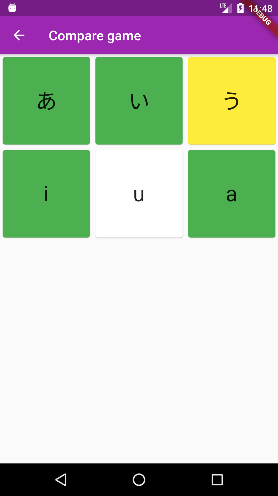

# Japanese explorer
I want to making learning procces easy. And I'll add many functions for that. 
For example I'll Create "Topics" for words which you want to learn. 

Also we need to study for remember this words. For this I'll create "Games" which can make this proccess more easy. Also I'll make standart things like exams etc.

If you want to listen native speakers you can listen radio. I'll add some radio streams in my programm. Also I'll add History, Geographic and Culture into my app. 

After all of this, I gues that I will help you with virtual travel in Japan. 
Thanks for reading.
